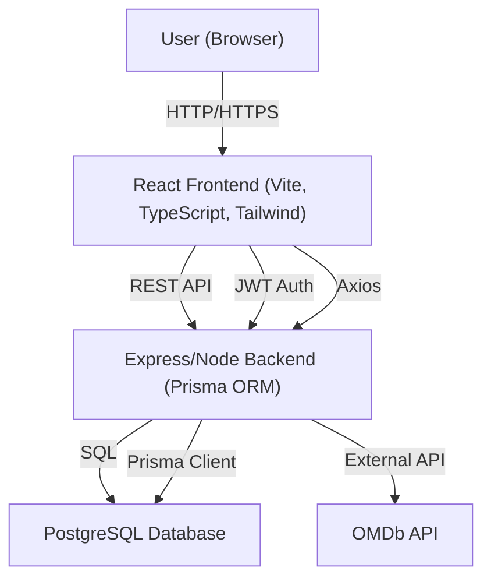

# Movie Recommendation Platform

---
**Looking for the backend?**
👉 [Movie-Reco-backend on GitHub](https://github.com/DipanshuOjha/Movie-Reco-backend)
---

A modern, full-stack movie recommendation platform with smart AI-powered suggestions, user authentication, and a beautiful UI.

---

## 🏗️ Architecture



---

## ✨ Features
- User registration & login (JWT Auth)
- Browse, add, and rate movies
- Import movies from OMDb API
- Smart recommendations (hybrid, content-based, collaborative)
- Personalized user profile & stats
- Responsive, modern UI (Tailwind CSS)
- Error handling & loading states

---

## 🤖 AI-Powered Recommendations (Cohere)

Our platform now features a dedicated **AI (Cohere)** tab on the Smart Recommendations page!

### Why Use an LLM for Recommendations?
Traditional recommendation systems use algorithms like content-based or collaborative filtering, which rely on matching genres, user ratings, or similar users. While effective, these methods can be limited in creativity and context-awareness.

By integrating a **Large Language Model (LLM)**, we unlock:
- **Deeper understanding of user preferences** (beyond just genres or ratings)
- **Contextual and creative suggestions** (the LLM can "think" about your taste holistically)
- **Adaptability** (the LLM can handle nuanced prompts, dislikes, and even new movie titles)

### Which LLM is Used?
We use the **Cohere Command model**, a state-of-the-art LLM designed for text generation and reasoning. Cohere's model is known for its strong performance, reliability, and generous free tier for developers.

### How Does the LLM Recommendation Work?
- The backend gathers your movie ratings (likes/dislikes) and a list of available movies.
- It crafts a prompt like:
  > You are a movie recommendation AI.\nUser likes: Interstellar, Player, Jurassic Park\nUser dislikes: none\nHere is a list of movies: ...\nRecommend 10 movies from the list above that best match the user's taste. Return only a JSON array of movie titles.
- The Cohere LLM processes this prompt and returns a list of movie titles tailored to your taste.
- The frontend displays these as recommendations in the **AI (Cohere)** tab.

### What Makes LLM Recommendations Unique?
- **Context-aware:** Considers your likes, dislikes, and the full movie list in one go.
- **Creative:** Can suggest less obvious but relevant movies, not just those with matching genres.
- **Flexible:** Works even if you have unusual or sparse rating patterns.

### Limitations
- **API limits:** Free tier has a quota; heavy use may require a paid plan.
- **Response time:** LLMs can take a few seconds to generate results, especially on first use.
- **Occasional hallucinations:** The LLM might suggest a movie not in your database (rare, but possible).

**In summary:** LLM-powered recommendations bring a new level of intelligence and personalization to your movie experience, going beyond classic algorithms for a smarter, more enjoyable platform.

### How to Enable Cohere AI Recommendations
1. **Sign up at Cohere:** https://dashboard.cohere.com/api-keys
2. **Get your API key** and add it to your backend `.env`:
   ```
   COHERE_API_KEY=your_cohere_api_key_here
   ```
3. **Restart your backend server.**

---

## 🧠 How the Recommendation System Works

Our platform uses a combination of recommendation algorithms to provide personalized movie suggestions:

### 1. Content-Based Filtering
- Analyzes the features of movies you have rated highly (e.g., genre, director, year).
- Recommends movies with similar attributes that you haven't seen yet.

### 2. Collaborative Filtering
- Finds users with similar movie tastes (based on rating patterns).
- Suggests movies liked by similar users that you haven't rated yet.

### 3. Hybrid Recommendations
- Combines both content-based and collaborative approaches for smarter, more diverse suggestions.
- Merges results and removes duplicates for the best experience.

### 4. User Profile & Preferences
- Tracks your favorite genres, directors, and years based on your ratings.
- Displays your movie-watching profile and stats.

### 5. External Data (OMDb API)
- Uses the [OMDb API](https://www.omdbapi.com/) to import rich movie data (plot, director, year, poster, etc.).
- Enhances the database for better recommendations.

### 6. AI (Cohere) Recommendations
- Uses the Cohere LLM to generate recommendations based on your likes/dislikes and the movie catalog.
- Access this feature via the **AI (Cohere)** tab in the Smart Recommendations page.

**All recommendation logic is handled in the backend (Node.js/Express) using Prisma ORM to query the PostgreSQL database, and Cohere for AI-powered suggestions.**

---

## 📁 Folder Structure
```
project/
  src/
    components/      # Reusable UI components
    contexts/        # React context (Auth, etc.)
    pages/           # Main app pages (Dashboard, Movies, Recommendations, etc.)
    services/        # API service functions (axios)
    types/           # TypeScript types
    index.css        # Tailwind CSS
    main.tsx         # App entry point
  public/
  package.json
  tailwind.config.js
  tsconfig.json
  vite.config.ts
```

---

## 🚀 Setup & Development

1. **Clone the repo:**
   ```bash
   git clone <your-repo-url>
   cd project-bolt-sb1-y9vqxysn/project
   ```
2. **Install dependencies:**
   ```bash
   npm install
   ```
3. **Configure environment:**
   - Set up your `.env` for backend (DB, OMDb API key, Cohere API key, etc.)
   - Make sure PostgreSQL is running and accessible
4. **Run the frontend:**
   ```bash
   npm run dev
   ```
5. **(If backend is separate)**
   - Start backend server (see backend/README.md if present)

---

## 🧑‍💻 Usage
- Register or log in
- Browse and rate movies
- Import new movies from OMDb
- Visit the "Smart Recs" page for personalized recommendations
- Try the **AI (Cohere)** tab for LLM-powered suggestions
- View your profile and stats

---

## ❤️ Credits
Made with heart by **Dipanshu Ojha** 